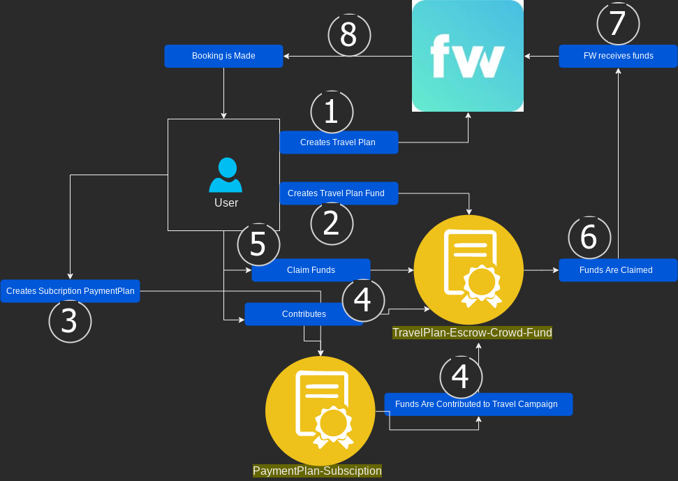
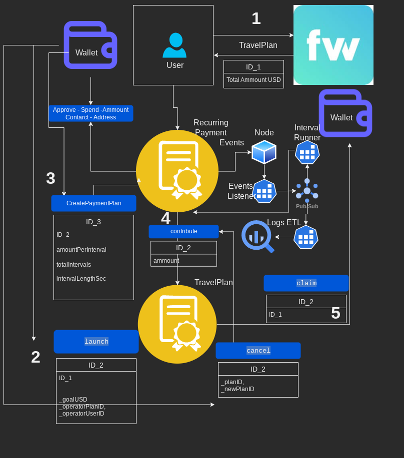
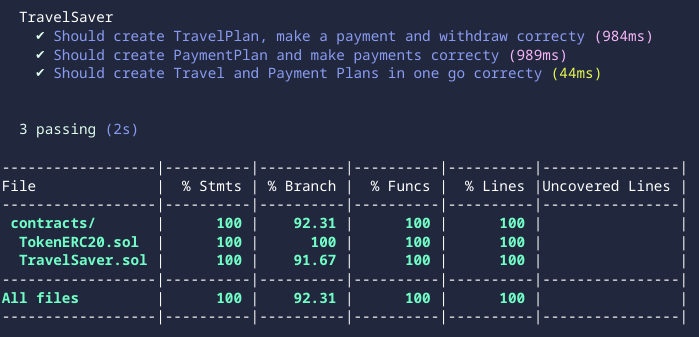

# BIRDIE

## savings vault with automated scheduled payments

- solidty smart contract
- with coverage tested
- deployed to test and main networks
- `deployment scripts` for network specific `ERC20 token` and `destination address`
- off chain payments integrators as below
- real time RPC log consumer with ETL pipes and contact writer[vitalik] (https://github.com/karolsudol/vitalik)

 

</a>

 

# Travel Saver Smart Contract

1. `TravelPlan`: escrow and crowd-funding service: where user creates campaign(s) against flywallet travel-plan(s).

   - User creates a `WEB3-TravelPlan` against `WEB2-TravelPlan` that locks funds in escrow service.
   - Contributions can be made ad hoc by anyone or/and scheduled with `PaymentPlan` contract.
   - User can claim specific `Plan` that will result in funds to be withdawn to flight operator web3-wallet address, followed by the actual booking.

2. `PaymentPlan`: A companion object that allows any user to schedule payments to specific `TravelPlan`(s).

   - user creates `PaymentPlan`(s) againts specific `TravelPlan`(s) that creates scheduled payments to it
   - user can cancel any plan at any time but funds are locked in `TravelPlan` unless user `claims` it
   - off chain application will attempt to make shceduled payment on behalf of the user
   - in case of insufficent funds: next scheduled attempt will trigger any missed payments on top of scheduled one
   - user can also make missing payments manually

# User Story

 

</a>

 

User wants to make multiple future travel reservation and crowd-fund - schedule payments towards them.

Follow the above diagram:

1. User makes a travel plan(s) via [operators](https://flywallet.io) booking service.

2. User creates savings plan(s) this time in `TravelPlan` smart contract where contributions will be made and funds will be stored against `1`.

3. User creates `PaymentPlan`(s) againts specific `TravelPlan` and defining how much, how many and how ofter he/she wishes to make payments of.

4. Schedules payments are triggered automatically as per `3`. Funds are moved from user's wallet to `TravelPlan`'s contract.
5. In addition, user can contribute directly to any `TravelPlan`(s) as long as they exist and have not been claimed.

6. User decided that ammout he/she collected is sufficient for the desired trip(s), and claims specific `TravelPlan`

7. `TravelPlan` makes a withdrawal to the `operatorlet-web3-address` for the ammount contributed in this plan UUID.

8. `operator` receives web3 funds, acknowleges their recepit and transferes the ammount into user's fiat account inside `operator`

9. Immadiatelly after, `operator` purchases the travel booking(s)

# Smart Contract Usage

## TravelPlan:

- `createTravelPlan(uint256 operatorPlanID_, uint256 operatorUserID_`

- `contributeToTravelPlan(uint256 UUID, uint256 amount)`

- `claimTravelPlan(uint256 UUID, uint256 amount)`

- `getTravelPlanDetails(uint256 UUID) returns (TravelPlan)`

## PaymentPlan:

- `createPaymentPlan(uint256 _travelPlanID, uint256 amountPerInterval, uint256 totalIntervals,uint256 intervalLength)`

- `cancelPaymentPlan(uint256 UUID)`

- `getPaymentPlanDetails(uint256 UUID) returns (PaymentPlan)`

- `runInterval(uint256 UUID)`

- `runIntervals(uint256[] memory UUIDs)`

## TravelPaymentPlan

- `createTravelPaymentPlan(uint256 operatorPlanID_,uint256 operatorUserID_, uint256 amountPerInterval,uint256 totalIntervals,uint256 intervalLength)`

## NOTES:

- NOTE: user's address needs to approve to spend agreed ammount by calling:
  `token.approve(address(TravelSaver), totalAmount)` and `token.approve(address(TravelSaver), totalAmount)`
- NOTE: both contracts interact with eachother only within deployed specfic network with specfic `IERC20` address.

# DEPLOYMENTS

## Deployed at {network_name} with IERC20 token, smart-contract and operator address as:

1. - Celo

   - alfajores:

     - cUSD: `0x765de816845861e75a25fca122bb6898b8b1282a`
     - TravelSaver: `0x54713127daf2bFD5129C980Ea800E3fCD616B547`
     - [verified](https://explorer.celo.org/alfajores/address/0x54713127daf2bFD5129C980Ea800E3fCD616B547/contracts)

     - operatorWalletAddress: `0x2b5Fc7f001a173D49B29e34993bB2feF41Ccd803`

   - mainnet:

     - cUSD: `0x765de816845861e75a25fca122bb6898b8b1282a`
     - TravelSaver: `0x207856B02b264b7C60fdE304658d683184254330`

     - operatorWalletAddress: `0x702D8Ef9255505378922F4A0206542a7DcF6947B`

2. - Polygon

   - mumbai:

     - USDC: `0xe11A86849d99F524cAC3E7A0Ec1241828e332C62`
     - TravelSaver: `0x54713127daf2bFD5129C980Ea800E3fCD616B547`
     - [verified](https://mumbai.polygonscan.com/address/0x54713127daf2bFD5129C980Ea800E3fCD616B547#code)

     - operatorWalletAddress: `0x2b5Fc7f001a173D49B29e34993bB2feF41Ccd803`

   - mainnet:

     - USDC: `0x2791bca1f2de4661ed88a30c99a7a9449aa84174`
     - TravelSaver: `0x6Bd249181BAdf2a389296D68f80A8B1c74fDDAC1`
     - [verified](https://polygonscan.com/address/0x6Bd249181BAdf2a389296D68f80A8B1c74fDDAC1#code)

     - operatorWalletAddress: `0x702D8Ef9255505378922F4A0206542a7DcF6947B`

3. - BSC

   - testnet:

     - USDT: `0x337610d27c682E347C9cD60BD4b3b107C9d34dDd`
     - TravelSaver: `0x54713127daf2bFD5129C980Ea800E3fCD616B547`
     - [verified](https://testnet.bscscan.com/address/0x54713127daf2bFD5129C980Ea800E3fCD616B547#code)

     - operatorWalletAddress: `0x2b5Fc7f001a173D49B29e34993bB2feF41Ccd803`

   - mainnet:

     - USDT: `0x55d398326f99059ff775485246999027b3197955`
     - TravelSaver: `0x6Bd249181BAdf2a389296D68f80A8B1c74fDDAC1`
     - [verified](https://bscscan.com/address/0x6Bd249181BAdf2a389296D68f80A8B1c74fDDAC1#code)

     - operatorWalletAddress: `0x702D8Ef9255505378922F4A0206542a7DcF6947B`

## TravelSaver constructor params:

- `address _IERC20` USD ERC20 network specific address.
- `address _operatorWallet` wallet address where all funds will be transfered when saving plan is sucessful.

## Re-Deploying to a networks, tests and scripts:

- `npm install hardhat`

- `npx hardhat coverage`

- `npx hardhat run --network {NETWORK} scripts/deploy-{NETWORK}-{BRANCH}-{ERC20}.ts`

## Architecture: all services

 

</a>

 

## TESTS COVERAGE

 

</a>

 
